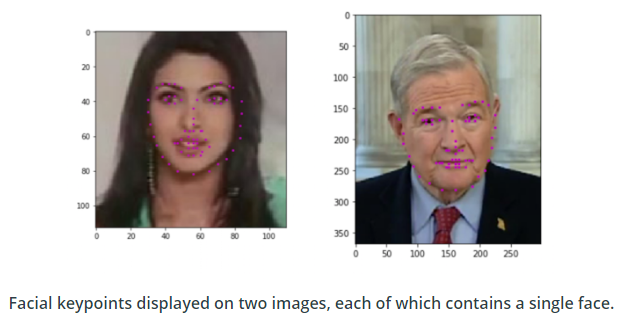

# Project : Facial Keypoint Detection

## Description
In this project, we build a facial keypoint detection system 
that takes in any image with faces, and predicts the location
of 68 distinguishing keypoints on each face.

Facial keypoints include points around the eyes, nose, and mouth on a face and are used in many applications. These applications include: facial tracking, facial pose recognition, facial filters, and emotion recognition. 

Some examples of these keypoints are pictured below.

## Files

* `Notebook 1`: Loading and visualizing the facial keypoint data
* `Notebook 2`: Defining and Training a Convolutional Neural Network (CNN) to predict facial keypoints
* `Notebook 3`: Facial keypoint detection using haar cascades and the trained CNN
* `Notebook 4`: Fun filters and keypoints uses
* `models.py`: Define the neural network architectures 
* `data_load.py`: Data transforms classes

## Data Augmentation 

 Random cropping is used to augment our train data which is implemented in`data_load`

## Transforms

Augmentation of the train set is performed.

### Training dataset
Pipeline to transform the train set:

* Rescale the image to (250, 250) for the width and height
* Random crop the image to (224, 224)
* Normalize : convert color image to grayscale and normalize the color range to [0, 1] as well as scale keypoints around 0 with a range of [-1, 1]
* Convert to tensor

### Test dataset
Pipeline to transform test dataset:

* Rescale the image to (224, 224) for the width and height
*  Normalize : convert color image to grayscale and normalize the color range to [0, 1] as well as scale keypoints around 0 with a range of [-1, 1]
* Convert to tensor

## Model architecture

The architecture is similar to the **Naimish** architecture. I changed the activation functions and added additional dropout layers.

| Layer               	| Details                                                                                          	|
|---------------------	|--------------------------------------------------------------------------------------------------	|
| Input               	| size : (224, 224, 1)                                                                             	|
| Conv 1              	| # filters : 32;  kernel size : (5 x 5);  stride : (1 x 1);   padding : 0;   activation : relu   |
| Max Pooling         	| kernel size : (2 x 2);  stride : (2 x 2);  padding : 0 (VALID)                                                
| Conv 2              	| # filters : 64;  kernel size : (3 x 3);  stride : (1 x 1);   padding : 0 (SAME);   activation : relu 	|
| Max Pooling         	| kernel size : (2 x 2);  stride : (2 x 2);  padding : 0 (VALID)                                     	|
| Conv 3              	| # filters : 128;  kernel size : (3 x 3); stride : (1 x 1);  padding : 0 (SAME); activation : relu   	|
| Max Pooling         	| kernel size : (2 x 2);  stride : (2 x 2);  padding : 0 (VALID)                                     	|
| Conv 4              	| # filters : 256;  kernel size : (1 x 1);  stride : (1 x 1);   padding : 0 (SAME);   activation : relu  	|
| Max Pooling         	| kernel size : (2 x 2);  stride : (2 x 2);  padding : 0 (VALID)                                     	|         
| Flatten             | (13 x 13 x 256) => 43264               |
| Fully Connected 1   | # neurons : 1000; activation : relu   |
| Dropout             | probability : 0.3                   |
| Fully Connected 2   | # neurons : 500; activation : relu   |
| Dropout             | probability : 0.4                   |
| Output              | size : (136 x 1)                    |

